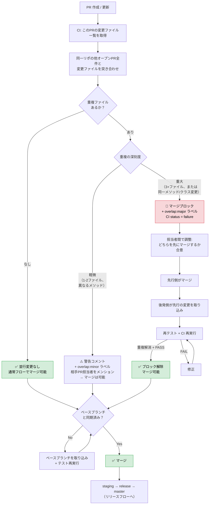

# 開発運用ガイド

> **SSoT**: 本ファイル (`ai_team_v2/docs/manual/development-guide.md`) = GitHub 機能運用 + リポ運用 + コーディング規範 の正本。Platform 全リポジトリ共通の **GitHub 運用ルール** (Issue / PR / Milestone / Project Board / branch / worktree) + **リポ運用** (SSoT 配信 / 構造変更チェックリスト、§6) + **コーディング規範** (PJ 固有 規約は `docs/operations/coding-style.md` 参照) を declared する。
>
> **scope 限定**: GitHub 機能運用 + リポ運用 + コーディング規範 **のみ**。設計プロセス (L1〜L5 / Cap / Component) は **`design-process-guide.md`** / 配置 path tree は **`artifact-placement-guide.md`** / G0 PJ 管理 + PM デリバリー は **`pj-process-guide.md`** を参照 (DR-360 4 ガイド責務分離)。

## 4 ガイド責務分離

| ガイド | scope |
|---|---|
| **本ファイル (development-guide)** | GitHub 機能運用 (Issue / PR / Milestone / branch / worktree) + リポ運用 (SSoT 配信 / 構造変更チェックリスト) + コーディング規範 |
| `design-process-guide` | L1〜L5 設計プロセス + `docs/` + `src/` 配下成果物 一覧 + 命名規則 + 記載ルール |
| `pj-process-guide` | G0 PJ 管理 + `docs/deliverables/` 配下成果物 + 命名規則 + 記載ルール + PM artifacts 生成プロセス |
| `artifact-placement-guide` | 配置 path tree のみ + DR 物理配置 |

## 目次

- [0. 全体の関係図](#0-全体の関係図)
  - [関係のルール / Done の定義](#関係のルール)
- [1. Issue](#1-issue)
  - [作り方 / Issue Type / ラベル / Status フロー / Size 見積もり / 親 Issue・子 Issue](#作り方)
- [2. PR (Pull Request)](#2-prpull-request)
  - [基本原則 / 並行変更検出 / ブランチ鮮度 / Nightly Full Test / PR サイズガード](#基本原則)
- [3. Milestone](#3-milestone)
- [4. Project Board](#4-project-board)
- [5. 自動化](#5-自動化)
  - [自動ラベリング / Status 同期 / 並行変更 CI / ブランチ鮮度 CI / Nightly / PR サイズ / 自動化が効かないケース](#自動化が効かないケース)
- [コーディング規範 (declared)](#コーディング規範-declared)
- [§6: リポ運用 (SSoT 配信 / 構造変更チェックリスト)](#6-リポ運用-ssot-配信--構造変更チェックリスト)

---

## 0. 全体の関係図

```
┌─────────────────────────────────────────────────────────┐
│  Platform Dev Board (#36)                                │
│  ┌─────────────────────────────────────────────────┐    │
│  │ Milestone: v10.1.0 (Due: 2026-03-15)            │    │
│  │                                                  │    │
│  │  [親 Issue] backend#100: パートナーAカード払い        │    │
│  │    ├─ [子] backend#101 ← PR backend#105 (refs)      │    │
│  │    │                  ← PR backend#108 (closes)    │    │
│  │    ├─ [子] n8n-workflows#50 ← PR n8n-workflows#55 (closes)  │    │
│  │    └─ [子] ea#200     ← PR ea#205 (closes)      │    │
│  │                                                  │    │
│  │  [単独 Issue] backend#110 ← PR backend#112 (closes)  │    │
│  └─────────────────────────────────────────────────┘    │
│                                                         │
│  [他の Milestone / Milestone なしの Issue ...]          │
└─────────────────────────────────────────────────────────┘
         ↕ client: ラベル付き Issue は両方に存在
┌─────────────────────────────────────────────────────────┐
│  デリバリー Project (#33 Kyoto Bank)                    │
│  PM がフェーズ管理（Internal Review → External → Done） │
└─────────────────────────────────────────────────────────┘
```

### 関係のルール

| 関係 | 多重度 | 説明 |
|------|:---:|------|
| Project ↔ Issue | N:N | 1つの Issue は複数 Project に属せる（Platform Dev Board + デリバリー） |
| Milestone → Issue | 1:N | 1つの Issue に Milestone は1つ。Milestone に紐づく Issue は複数 |
| 親 Issue → 子 Issue | 1:N | 親の sub-issues progress バーで全体進捗を表示 |
| Issue → PR | 1:N | 1 Issue に複数 PR 可。途中は `refs`、最後だけ `closes` |
| PR → Issue | N:1 | 1 PR で複数 Issue を `closes` 可（まとめて解決） |

### Done の定義（2段階）

```
Issue Status = Done  →  開発完了（テスト通過）。開発者が管理
Milestone = Closed   →  リリース完了（デプロイ済み）。PM が管理
```

---

## 1. Issue

### 作り方

Issue は**テンプレートから作成**する。テンプレートのドロップダウンで Product / Priority / Client を選択すると、Product / Client は対応するラベルが自動付与され、Priority は Project フィールドに自動設定される（`project-sync.yml`）。

テンプレートを使わずに Issue を作成した場合は、ラベルを手動で付与すること。

| テンプレート | ファイル名 | 用途 | Issue Type | 固有フィールド |
|------------|-----------|------|-----------|-------------|
| Bug Report | `bug.yml` | バグ報告 | Bug | Impact Scope(必須), Steps to Reproduce(必須), Reproducibility |
| Feature Request | `feature.yml` | 新機能提案 | Feature | Background & Motivation(必須), Acceptance Criteria(必須), Scope |
| Enhancement | `enhancement.yml` | 既存機能の改善 | Enhancement | Current Problem(必須), Proposed Improvement(必須), Scope |
| Tech Debt | `tech-debt.yml` | 技術的負債の解消 | Tech Debt | Impact(必須), Proposed Approach |
| Task | `task.yml` | 作業タスク | Task | Task Description(必須), Definition of Done(必須) |

全テンプレート共通フィールド: Product(必須), Priority(必須), Client(任意)。Priority はラベルではなく Project の Priority フィールドで管理する

大きい Feature/Enhancement は Sub-issues に分解する。テンプレートの Scope フィールドに除外事項を明記すること。

#### リポ固有テンプレート

業務固有のフローがあるリポでは、上記5種に加えてリポ固有テンプレートを追加してよい（命名は kebab-case の `.md` か `.yml`）。例:

| リポ | テンプレート | 用途 |
|------|------------|------|
| n8n-workflows | `RCA.md` | Root Cause Analysis（インシデント分析） |
| n8n-workflows | `institution-add.md` | 金融機関新規追加（接続情報 / 試験 / 本番） |

リポ固有テンプレートは「既存の標準5種で代替できないか」を必ず検討してから追加すること。標準5種のサブセット・古い派生・空テンプレは廃止対象。

### Issue Type

Issue の種別は GitHub ネイティブの **Issue Types** で管理する（ラベルではない）。テンプレート選択時に自動設定される。

| Issue Type | 色 | 用途 |
|-----------|---|------|
| Task | 黄 | 一般的な作業タスク |
| Bug | 赤 | バグ報告 |
| Feature | 緑 | 新機能 |
| Enhancement | 青 | 既存機能の改善 |
| Tech Debt | 灰 | 技術的負債の解消 |

### ラベル

2軸のラベルで Issue を分類する（種別は Issue Type、Priority は Project フィールドで管理するためラベル不要）。これに加えて、自動化ワークフローが付与する自動化用ラベルがある。

| 軸 | 例 | 付与方法 | 必須/任意 |
|----|-----|---------|:---:|
| `product:` | `product:video` | テンプレートから自動 | **必須** |
| `client:` | `client:partner-a` | テンプレートから自動（該当時のみ） | 任意 |
| 自動化用 | `overlap:major` | ワークフローが自動付与 | 自動 |

- `product:` は 1 Issue に1つ。複数プロダクトにまたがる場合は**主たるプロダクト**を選ぶ
- `client:` は特定クライアント要望で生まれた Issue にのみ付与。汎用機能として全クライアントに展開する場合は外す
- Priority は Project の Priority フィールドで管理する（`project-sync.yml` がテンプレートの値を自動設定）。未設定の場合は P3 相当として扱う
- **本ガイドに記載のないラベルは作成・使用禁止**。GitHub デフォルトの `bug` / `enhancement` / `documentation` 等は Issue Type で代替済みのため使わない（リポセットアップ時に削除）

#### product ラベル一覧

| ラベル | プロダクト |
|--------|-----------|
| `product:video` | Video（動画生成） |
| `product:publish` | Publish（TikTok投稿） |
| `product:affiliate` | Affiliate（Shopee連携） |
| `product:analytics` | Analytics（パフォーマンス分析） |
| `product:platform` | Platform（基盤・N8N） |

#### client ラベル一覧

| ラベル | クライアント |
|--------|------------|
| `client:partner-a` | パートナーA |
| `client:partner-b` | パートナーB |
| `client:partner-c` | パートナーC |

#### 自動化用ラベル一覧

ワークフローが Issue / PR に自動付与するラベル。手動で付与・削除しない。

| ラベル | 付与元 | 用途 |
|--------|--------|------|
| `overlap:minor` | `pr-overlap.yml` | 軽微な並行変更検出（マージ可能） |
| `overlap:major` | `pr-overlap.yml` | 重大な並行変更検出（マージブロック） |
| `needs-rebase` | `branch-freshness.yml` | ベースブランチ乖離（計画中） |
| `branch-freshness` | `branch-freshness.yml` | 鮮度チェック対象 Issue / 警告コメント |
| `shared-infra` | `branch-freshness.yml` | 共有基盤ファイル変更を含むブランチ |
| `nightly-failure` | `nightly-full-test.yml` | ナイトリーテスト失敗で起票された Issue |

### Status フロー

Issue の進捗は Platform Dev Board の Status で管理する（7段階）。

```
Backlog → Todo → In Progress → In Review → Testing → Done
                                                       ↕
                                                    Blocked
```

| Status | 意味 | 誰がいつ変えるか |
|--------|------|----------------|
| Backlog | 未トリアージ / 優先度未決定 | 自動（Issue 作成時のデフォルト） |
| Todo | 着手予定（優先度確定済み） | PM/Lead がトリアージ時に |
| In Progress | 作業中 | 開発者が着手時に |
| In Review | PR 作成済み・コードレビュー待ち | 開発者が PR 作成時に |
| Testing | テスト実施中 | 開発者がレビュー通過後に |
| Done | 開発完了（テスト通過） | 自動（PR マージ時） |
| Blocked | 外部要因で作業停止 | 発生時に変更 + コメントで理由記載 |

**Done = 「開発完了」であり「リリース済み」ではない。** リリース管理は Milestone で行う（後述）。

テスト不要な Issue（docs、設定変更等）は In Review → Done でスキップ可。

### Size 見積もり

| Size | 目安 | 例 |
|------|------|-----|
| XS | 数時間、1 PR | typo 修正、設定値変更 |
| S | 1〜2日、1-2 PR | API エンドポイント1本追加 |
| M | 3〜5日、2-3 PR | 機能の一部実装 |
| L | 1〜2週、3-5 PR | 機能の全体実装 |
| XL | 2週以上 | **分割必須** → 親 Issue + sub-issues に |

### 親 Issue / 子 Issue（sub-issues）

#### いつ分割するか

| 条件 | 構造 |
|------|------|
| Size XS-M、単一リポ内で完結 | **単独 Issue**（分割不要） |
| Size L（3-5 PR） | **親 + sub-issues に分割** |
| Size XL（2週超） | **分割必須** |
| 複数リポにまたがる | **親 Issue + 各リポに sub-issues** |
| クライアントデリバリー | **Epic（親）+ sub-issues** |

#### 親 Issue

| 項目 | ルール |
|------|--------|
| 配置リポ | 主たる変更が入るリポ |
| タイトル | **目的**を書く。例: 「3Dセキュア対応」 |
| 本文 | ゴール、スコープ、完了条件 |
| ラベル | `product:`, `client:`（該当時） |
| Issue Type | テンプレートから作成時に自動設定（Feature / Bug / Enhancement / Tech Debt / Task） |
| Assignee | 全体管理者（PM / CTO） |

#### 子 Issue

| 項目 | ルール |
|------|--------|
| 粒度 | **1 子 Issue = 1 PR 可能な単位**（Size XS-M） |
| タイトル | 具体的な作業内容。例: 「3DS認証API実装」 |
| ラベル | 親と同じ `product:`, `client:` を継承 |
| Assignee | 実際の作業者 |
| 独立性 | 各子 Issue は独立してテスト・マージ可能であること |

#### 分割の観点

- レイヤー別: API / フロントエンド / バッチ / インフラ
- リポ別: backend / n8n-workflows / ea / infra
- 機能単位別: 認証 / 画面 / 通知 / ログ

分割後の各子 Issue が Size M 以下であることを確認する。L 以上ならさらに分割。

#### 例: クライアントデリバリー

```
[Epic] backend#30: パートナーA 連携 Phase 1
  ├── [子] backend#31: API連携の実装（Size M）
  ├── [子] backend#32: 認証フロー実装（Size M）
  ├── [子] n8n-workflows#12: パートナーA 接続設定（Size S）
  └── [子] dashboard#8: パートナーA Analytics表示（Size S）
```

- Epic の sub-issues progress バーで全体進捗が自動表示される
- 子 Issue が全てクローズ → 親 Issue を手動でクローズ

---

## 2. PR（Pull Request）

### 基本原則

- **ベースブランチは壊さない**: ベースブランチ（`main` 等）への直 push 禁止、必ず PR 経由
- **変更は小さく・目的単位に切る**: 1 PR = 1目的。大きい変更は「下準備 PR」→「本体 PR」で分割
- **ブランチは短命・こまめに同期**: 長期ブランチ放置禁止
- **履歴戦略**: Squash merge（デフォルト）。監査要件がある場合は merge commit も可

### 並行変更の検出と保護

複数の PR が同じファイルを並行して変更すると、マージ後に予期しない破壊が起きる。ファイルの分類（「共有基盤」「クライアント固有」等）ではなく、**同一リポジトリ内のオープン PR 間でのファイル重複** を直接検出し、強制力のある仕組みで保護する。

#### 設計思想: リリース可能な単位を極小化する

**目的: ベースブランチを常に「どのクライアントがいつリリースしても壊れない」状態に保つ。**

各 PR のマージが「リリース可能な状態」を維持していることを保証する。そのために:
1. **PR ごとに並行変更を検出** — 他のオープン PR と同じファイルを変更していないか CI が自動チェック
2. **重複がなければ安全にマージ可能** — 他の作業者に影響しない
3. **重複があれば調整を強制** — 先行マージ側を決め、後発側は取り込んでからマージ

```
Before（問題）:
  PR#100 (feature/video): user.rb, auth_module.py を変更
  PR#200 (feature/publish): auth_module.py を変更（PR#100 を知らない）
  → 両方マージされると auth_module.py が壊れる

After（解決）:
  PR#100 作成時: CI が「並行変更なし」→ 通常マージ
  PR#200 作成時: CI が「auth_module.py が PR#100 と重複」→ マージブロック
  → PR#100 が先にマージ → PR#200 が取り込んで再テスト → 安全にマージ
```

#### 全体ワークフロー



---

#### 並行変更検出（`pr-overlap.yml`）

全ての保護の主軸。PR 作成/更新時に、同一リポ内の他オープン PR との変更ファイル重複を自動検出する。

##### 検出ロジック

```bash
# このPRの変更ファイル
my_files=$(gh pr diff $PR_NUMBER --name-only)

# 同一リポの他オープンPR全件と突き合わせ
for other_pr in $(gh pr list --state open --json number -q '.[].number'); do
  [ "$other_pr" = "$PR_NUMBER" ] && continue
  other_files=$(gh pr diff $other_pr --name-only)
  overlap=$(comm -12 <(echo "$my_files" | sort) <(echo "$other_files" | sort))
  if [ -n "$overlap" ]; then
    # 重複ファイル・相手PR番号・担当者を記録
  fi
done
```

##### 重複度の判定と強制力

| 重複度 | 条件 | CI ステータス | ラベル | マージ |
|:---:|------|:---:|------|:---:|
| **なし** | 重複ファイルゼロ | `success` | — | **可能** |
| **軽微** | 重複 1〜2 ファイル、かつ同一メソッド/クラスの変更なし | `success` | `overlap:minor` | **可能**（警告付き） |
| **重大** | 重複 3+ ファイル、または同一メソッド/クラスを変更 | **`failure`** | `overlap:major` | **ブロック** |

**「同一メソッド/クラスの変更」の判定**: diff のハンク情報（`@@ -N,M +N,M @@ method_name`）から変更箇所のメソッド/クラス名を抽出し、両 PR で一致するか比較する。

##### 重大な重複が検出された場合の CI コメント

```markdown
🚫 **並行変更検出: マージをブロックしています**

このPRは以下のオープンPRと同じファイルを変更しています:

| 重複ファイル | 相手PR | 担当者 | 重複箇所 |
|------------|--------|--------|---------|
| `app/models/user.py` | #200 @tanaka | `User#validate_email` |
| `app/services/auth.rb` | #200 @tanaka | ファイルレベル |
| `lib/bizsol/authorize.rb` | #150 @suzuki | `AuthModule#check` |

**やるべきこと**:
1. 相手PRの担当者と調整し、**どちらが先にマージするか**合意する
2. 先行側がマージされたら、そのコミットを取り込む: `git fetch origin && git merge origin/{base}`
3. コンフリクトがあれば解消し、テストを通す
4. CI を再実行すると、重複が解消されていればブロックが解除されます
```

##### 軽微な重複が検出された場合の CI コメント

```markdown
⚠️ **並行変更検出（軽微）: マージは可能ですが注意してください**

このPRは以下のオープンPRと同じファイルを変更しています:

| 重複ファイル | 相手PR | 担当者 |
|------------|--------|--------|
| `config/routes.rb` | #180 @yamada |

変更箇所が異なるため、マージは可能です。
ただし、相手PRがマージされた後にコンフリクトが発生する可能性があります。
```

---

#### ブランチ鮮度チェック（`branch-freshness.yml`）

並行変更検出が「横方向の保護」（PR 間の重複）なら、鮮度チェックは「縦方向の保護」（ベースブランチとの乖離）。

| 閾値 | CI アクション | 強制力 |
|------|-------------|:---:|
| **7日超** | PR に警告コメント | 警告 |
| **14日超** | Issue 自動起票 + 担当者アサイン | 警告 |
| **staging マージ前** | ベースブランチ同期チェック → `needs-rebase` ラベル → **CI `failure`** | **ブロック** |

> **注**: `needs-rebase` ラベルの自動付与は計画中の機能であり、現時点では未実装。手動でベースブランチとの同期状態を確認すること。

**7日・14日の警告は無視できるが、staging マージ時にブロックされるため最終的には強制される。**

---

#### CODEOWNERS + ブランチ保護（ゲートキーパー）

並行変更検出に加え、重要ファイルの変更には承認を必須化する。

**ブランチ保護ルール（GitHub Ruleset 推奨設定）**:

| 設定 | 値 | 理由 |
|------|-----|------|
| **Require review from Code Owners** | ON | 重要ファイルの変更にゲートキーパーを設ける |
| **Dismiss stale approvals on new push** | ON | 並行 PR マージ後の再レビューを強制 |
| **Require status checks** | `pr-overlap`, `ci-test` | 並行変更検出 + テストを必須化 |
| **Require branches to be up to date** | ON | ベースブランチ同期を強制 |
| **Do not allow bypassing** | ON | 管理者含め全員に強制 |

---

#### AI レビューでの並行変更チェック（DR 整合性検証）

CI のファイルレベル検出では捕捉できない**暗黙的依存**（DR の前提崩壊、module include の副作用等）を AI レビューで補完する。

`/review` スキルの Phase 1 で:
1. 全オープン PR の変更ファイル一覧を取得
2. このPRの変更と直接的・間接的な依存関係があるか分析
3. DR の前提コードベースが最新の状態と整合しているか検証
4. 乖離がある場合は **Critical 指摘**として報告

**CI のファイル重複検出が「同じファイルを触っているか」なら、AI レビューは「影響し合うか」を検出する唯一の層。**

---

#### 全施策の評価サマリ

| 施策 | トリガー | 検出対象 | 強制力 | 認知負荷 |
|:---|:---|:---|:---:|:---:|
| **並行変更検出** (pr-overlap) | PR 作成/更新 | 他オープン PR とのファイル重複 | **ブロック**（重大時） | **ゼロ** |
| **鮮度チェック** (branch-freshness) | 週次 + staging マージ前 | ベースブランチとの乖離 | **ブロック**（staging 時） | **ゼロ** |
| **CODEOWNERS** | PR レビュー時 | 重要ファイルの変更 | **ブロック** | 低 |
| **ブランチ保護** (Ruleset) | マージ時 | ステータスチェック + 同期 | **ブロック** | **ゼロ** |
| **AI レビュー** | `/review` 実行時 | 暗黙的依存・DR 前提崩壊 | Critical 指摘 | **ゼロ** |
| **Nightly Test** | 日次 JST 3:00 | 暗黙的依存の事後検出 | Issue 起票 | **ゼロ** |
| **PR サイズガード** | PR 作成/更新 | 大きな PR への分割促進 | 警告のみ | **ゼロ** |

**並行変更検出でブロック → 調整 → 取り込み → 再テスト。この流れが強制されるため、「警告を無視してマージ」が構造的に不可能。**

---

### ケーススタディ

#### ケース1: 二人が同じファイルを並行変更

```
担当C: PR#100 で app/models/user.py を変更（feature/video）
担当E: PR#200 で app/models/user.py を変更（feature/publish）
```

1. PR#100 作成時: CI → 重複なし → `success`
2. PR#200 作成時: CI → `user.rb` が PR#100 と重複 → 同一メソッド変更あり → **`failure` + `overlap:major`**
3. 担当Eは担当Cと調整 → PR#100 を先にマージすることで合意
4. PR#100 マージ
5. 担当Eが `git merge origin/development` で取り込み → コンフリクト解消 → テスト PASS
6. PR#200 の CI 再実行 → PR#100 はもうクローズ済みなので重複解消 → `success` → マージ可能

#### ケース2: Hotfix と Feature PR の重複

```
緊急: PR#300 (hotfix/auth-fix) で lib/auth.py を修正
通常: PR#250 (feature/publish) で lib/auth.py を変更中
```

1. PR#300 作成時: CI → `lib/auth.py` が PR#250 と重複 → **`overlap:major`**
2. しかし hotfix は緊急 → CODEOWNERS / `#dev` で調整し PR#300 を優先マージすることで合意
3. PR#300 マージ → PR#250 が取り込み → 再テスト → マージ可能

**hotfix だから自動でブロック解除、という例外は作らない。** 人間が判断して優先順位を決める。CI はフェアにブロックする。

#### ケース3: DB マイグレーション衝突

```
PR#400 (feature/video): db/migrate/20260304_add_video_column.py を追加
PR#500 (feature/publish): db/migrate/20260304_add_publish_column.py を追加
```

1. `db/migrate/` 配下の新規ファイル追加は、ファイル名が異なるため**ファイル重複としては検出されない**
2. **補完**: `db/migrate/` の変更を含む PR は、CI で **マイグレーション順序の整合性チェック** を追加実行する（`bin/rails db:migrate:status` 等）
3. タイムスタンプ衝突がある場合は CI `failure`

#### ケース4: 暗黙的依存（ファイルレベルでは検出不可能）

```
PR#600: app/models/payment.py を変更（include AuthModule を追加）
PR#700: app/services/auth_module.rb を変更（メソッドシグネチャ変更）
→ ファイルは別だが、PR#600 は PR#700 の変更に影響を受ける
```

1. 並行変更検出: ファイル重複なし → `success`（検出**できない**）
2. **補完1**: AI レビュー（`/review`）が include/require の依存関係を分析し、Critical 指摘
3. **補完2**: Nightly Full Test で統合後の破壊を事後検出

**ファイルレベルの並行変更検出で全てをカバーできるわけではない。暗黙的依存は AI レビュー + Nightly Test で補完する。**

#### ケース5: 新メンバーがルールを知らない

```
新メンバー山田: 並行変更検出の警告を読まず、Approve をもらってマージしようとする
```

1. `overlap:major` → CI status `failure` → **マージボタンが無効**
2. Branch Protection の「Do not allow bypassing」→ 管理者も迂回不可
3. **ルールを知らなくても、仕組みがブロックするため問題は発生しない**

---

### PR スコープの推奨事項

並行変更検出が主軸だが、**そもそも重複が発生しにくい PR の切り方**を推奨する。

#### 推奨: 1 PR = 1 目的、小さく保つ

| 推奨事項 | 理由 |
|---------|------|
| **1つの Issue に対して 1つの PR** | 変更範囲が明確 |
| **リファクタリングと機能追加を混ぜない** | 重複ファイルが増え、ブロックされやすくなる |
| **DB マイグレーションは独立 PR** | 全クライアントに影響するため、小さく・先にマージ |
| **設定ファイル変更は独立 PR** | 共有ファイル（Gemfile, config 等）は重複しやすい |

#### 「分割不能な PR」の予防

| タイミング | ルール | 自動化 |
|----------|-------|--------|
| **Issue 作成時** | Size M 以上は Sub-issues に分解 | Issue テンプレート |
| **DR / 設計時** | 並行 PR との影響を DR に記載 | AI レビューが記載漏れを Critical 指摘 |
| **PR 作成後** | 並行変更検出でブロックされたら、先行 PR の完了を待つか PR を分割 | CI 自動ブロック |

#### 「もう分割できない」場合のエスカレーション

PR が既に大きくなり、他の PR と大量のファイル重複がある場合:

1. **PR を Draft に戻す** — これ以上のレビュー・CI リソースを止める
2. **相手 PR の担当者と相談**（CODEOWNERS → `#dev` チャンネル）— 優先順位とマージ順序を決定
3. **分割計画を作成** — 以下のいずれかを選択:
   - **A. 段階的分離**: 重複ファイルの変更を先に切り出して小さな PR にする
   - **B. 順序確定**: 一方を先にマージし、他方が取り込んで再テスト
   - **C. フィーチャーフラグ**: 変更を条件分岐で囲み、段階的にリリース
4. **Issue を作成** — 分割計画を Issue として起票し、Tech Debt として管理

#### PR サイズガード

##### 設計思想

**overlap 検出（pr-overlap.yml）が本質的な保護であり、PR サイズ制限は補助的な注意喚起である。** サイズが大きいこと自体はマージをブロックする理由にならない。一方で、大きな PR はレビュー品質の低下・overlap 発生確率の上昇・障害時の原因特定困難を招くため、閾値を超えた場合は警告コメントで分割を促す。

##### 「リリース可能な単位」の定義

PR は「全機能が完成している」必要はない。**既存機能を破壊しない**ことが条件である。

| 条件 | 説明 |
|------|------|
| テストが全て通る | CI 上の全テストスイートが PASS |
| 未完成機能が既存ユーザー導線に露出しない | フィーチャーフラグ、未到達コードパス、`internal` ルーティング等で隔離 |
| DB マイグレーションが安全に適用できる | ロールバック可能、既存カラム削除なし、デフォルト値設定済み |

この3条件を満たす限り、部分的な実装でもマージしてよい。大きな機能は複数 PR に分割し、段階的にマージする。

##### PR サイズ閾値（警告のみ、ブロックしない）

| サイズ | ファイル数 | 変更行数 | CI の挙動 |
|:---:|:---:|:---:|------|
| **S** | 〜5 | 〜200 | 通常（アクションなし） |
| **M** | 6-15 | 201-500 | 通常（アクションなし） |
| **L** | 16-30 | 501-1500 | 警告コメント + レビュー所要時間の見込み表示 |
| **XL** | 31+ | 1501+ | 強い警告 +「分割できない理由を PR 本文に記載してください」 |

- ファイル数・行数のいずれかが閾値を超えた場合、大きい方のサイズが適用される
- **いずれのサイズでもマージはブロックしない**。ブロックは overlap 検出（`pr-overlap.yml`）の責務
- `pr-size-guard.yml` が PR 作成/更新時に自動判定し、コメントを投稿する

##### auto-generated ファイルの除外

以下のパターンに一致するファイルはサイズ計算から除外する:

| パターン | 例 |
|---------|-----|
| `db/migrate/**` / `**/migrations/**` | DB マイグレーションファイル |
| `**/package-lock.json` / `**/yarn.lock` / `**/Gemfile.lock` / `**/poetry.lock` | ロックファイル |
| `**/openapi.yaml` / `**/openapi.json` | OpenAPI 定義（自動生成） |
| `**/*.snap` / `**/__snapshots__/**` | スナップショットテスト |
| `**/schema.rb` | Rails スキーマダンプ |

除外パターンはリポジトリごとにカスタマイズ可能（`.github/pr-size-guard.yml` の `exclude_patterns` で設定）。

##### 警告コメント（L サイズ）

```markdown
PR サイズ: L（{N}ファイル / {M}行変更）

このPRは通常より大きめです。レビュー所要時間の目安: {estimated_minutes}分

分割可能であれば、小さなPRに分けることでレビュー品質が向上します。
```

##### 警告コメント（XL サイズ）

```markdown
PR サイズ: XL（{N}ファイル / {M}行変更）

このPRは非常に大きいです。分割できない理由をPR本文に記載してください。

分割を検討する観点:
- リファクタリングと機能追加を別PRにできないか
- DBマイグレーションを先行PRで切り出せないか
- テストの追加・修正を独立PRにできないか
```

---

### テスト戦略

**原則: 各 PR のマージがリリース可能な状態を維持していることを、テストで保証する。**

#### テストの判定基準

| 条件 | テスト範囲 | 理由 |
|------|----------|------|
| 並行変更なし + 変更がクライアント固有ディレクトリ内 | 該当クライアントのテストのみ | 他クライアントに影響しない |
| 並行変更なし + 変更が共有コード | 全クライアント回帰テスト | 全クライアントに影響しうる |
| 並行変更あり（取り込み後） | 全クライアント回帰テスト | マージ結果の安全性を保証 |
| DB マイグレーション含む | 全クライアント回帰 + スキーマ整合性チェック | グローバルな共有状態 |

**テスト範囲の自動判定**: 変更ファイルのパスから CI が自動決定する（paths-filter 相当）。開発者が判断する必要はない。

#### Nightly Full Test（セーフティネット）

ファイルレベルの並行変更検出では捕捉できない暗黙的依存を、**1日1回の全クライアント結合テスト**で事後検出する。

**対象**: ベースブランチ（`development` 等）。マージ済みの全変更が統合された状態でテスト実行。

##### 自動化フロー（原因特定まで全て CI 内で完結）

```
① 全クライアント結合テスト実行（毎日 JST 3:00）
   │
   ├── PASS → 成功コミット SHA を記録して終了
   │
   └── FAIL
        │
        ② git bisect 自動実行
        │  前回成功 SHA 〜 HEAD の間で原因コミットを二分探索
        │
        ③ 原因コミット特定
        │  → そのコミットを含む PR 番号・担当者を gh CLI で逆引き
        │
        ④ Issue 自動起票（原因 PR の作成者にアサイン）
        │  Priority:P1（Project フィールド）+ 失敗テスト名 + エラー内容 + 原因コミット SHA
        │
        ⑤ Slack 通知（原因 PR 担当者をメンション）
```

**ポイント**: `git bisect run` で原因コミットまで CI が自動特定する。人間に bisect をやらせない。原因 PR の担当者を特定してから Issue を起票するため、**「誰が直すべきか」が明確な状態で Issue がアサインされる**。

##### git bisect 自動化の実装概要

1. 前回 Nightly 成功の SHA を `.nightly-last-green-sha` に記録（毎回更新）
2. 失敗時: `git bisect start HEAD {LAST_GREEN}` → `git bisect run bin/rails test` で原因コミットを自動特定
3. 原因コミット SHA → `gh pr list --search {SHA} --state merged` で PR 番号を逆引き
4. `gh pr view {PR_NUMBER} --json author` で担当者を特定
5. `gh issue create` で Issue 自動起票（担当者アサイン済み）

##### Issue テンプレート（自動起票内容）

```
タイトル: [Nightly] 結合テスト失敗 — {失敗テスト名}

## Nightly Full Test 失敗

- 失敗日時: 2026-03-04 03:00 JST
- ブランチ: development
- 原因コミット: abc1234 (PR #6925 by @tanaka)
- 失敗テスト: spec/models/user_spec.rb:42（パートナーCコンテキスト）
- エラー: NoMethodError: undefined method 'authorize_check'

### やるべきこと
1. 上記の原因コミットを確認し、修正 PR を作成してください
2. 修正マージ後、手動で結合テストを再実行して確認
```

##### 放置防止（エスカレーション）

| 経過時間 | アクション | 強制力 |
|---------|----------|:---:|
| 起票時 | 原因 PR 担当者にアサイン + Slack メンション | — |
| **48時間未対応** | CODEOWNERS → `#dev` → CTO にエスカレーション + Slack 再通知 | 警告 |
| **2日連続 Nightly 失敗** | **ベースブランチへの全 PR マージを一時停止** | **ブロック** |
| 修正 PR マージ後 | 手動で結合テスト再実行 → PASS で停止解除 | — |

**2日連続失敗でマージ停止**: ベースブランチが壊れた状態で新しい PR をマージし続けると被害が拡大する。全 PR をブロックすることで修正を最優先にする圧力をかける。

#### DB マイグレーションの扱い

| 変更種別 | ルール |
|---------|-------|
| **カラム/テーブル追加**（互換性あり） | 通常の PR に含めてよい |
| **カラム削除・リネーム**（破壊的） | **Expand/Contract パターン必須**: ①追加 → ②移行 → ③削除。各ステップ別 PR |
| **タイムスタンプ衝突** | CI が `db/migrate/` の並行追加を検出 → `failure` |

---

### マージ戦略

**原則: 並行変更のない PR は速やかにマージし、重複がある PR は調整を経てからマージする。**

#### マージ可能条件（全条件を満たすこと）

| # | 条件 | 検証方法 | 強制力 |
|:---:|------|---------|:---:|
| 1 | CI テスト PASS | Required Status Check | **ブロック** |
| 2 | 並行変更検出 PASS（重大な重複なし） | `pr-overlap` ステータス | **ブロック** |
| 3 | レビュー承認済み（CODEOWNERS 含む） | Branch Protection | **ブロック** |
| 4 | ベースブランチと同期済み | `Require branches to be up to date` | **ブロック** |

**4つ全てが `success` でないとマージボタンが押せない。例外なし。**

#### コンフリクト解消の責任

| 場面 | 責任者 |
|------|--------|
| 並行変更ブロック後の取り込み | **後発 PR の担当者** |
| ベースブランチ同期 | **PR の担当者** |
| staging へのマージ時 | **リリースマネージャー** |

---

### リリース戦略

**原則: どのクライアントがいつリリースしても他に影響しない。**

これは上流の並行変更検出 + ベースブランチ同期強制によって保証される:
- 全 PR は他のオープン PR との重複を解消してからマージされる
- 全ブランチは staging マージ前にベースブランチと同期される
- → ベースブランチは常にリリース可能状態

#### staging / release / master のゲート条件

| 遷移 | ゲート条件 | 強制力 |
|------|----------|:---:|
| → staging | ベースブランチ同期済み + テスト PASS + 並行変更解消済み | **ブロック** |
| → release | ステージング結合テスト PASS + QA 承認 | **ブロック** |
| → master | 最終テスト PASS + リリースマネージャー承認 | **ブロック** |

#### Hotfix フロー

| 種別 | フロー |
|------|--------|
| **通常 Hotfix** | `hotfix/{desc}` → `master` → バックポート PR を `{BASE_BRANCH}` 向けに作成 |
| **緊急度が高い場合** | 並行変更検出で他 PR とブロックし合う場合は、CODEOWNERS / `#dev` で優先順序を判断 |

**Hotfix でも並行変更検出は実行される。** 緊急だからといって自動で迂回はしない。

#### Feature Toggle（将来の拡張）

破壊的変更が頻繁になる場合、Feature Toggle（Rails: Flipper 等）の導入を検討:
- Toggle 作成時に有効期限を設定
- 期限切れ Toggle は CI 警告
- ON/OFF 切り替えは監査ログ記録（FinTech 要件）

---

### 警告・ブロックを受けた場合のアクションフロー

#### アクション対応表

| 通知 | 強制力 | あなたがやるべきこと |
|------|:---:|-------------------|
| **`overlap:minor`（軽微な重複）** | 警告 | 相手 PR の担当者に連絡。相手が先にマージする場合は、マージ後に取り込む |
| **`overlap:major`（重大な重複）** | **ブロック** | ① 相手 PR の担当者と調整 → ② 先行マージ側を決定 → ③ 先行側マージ後に取り込み → ④ 再テスト → CI 再実行 |
| **`needs-rebase`（ベースブランチ乖離）** [^needs-rebase] | **ブロック** | `git fetch origin && git merge origin/{BASE_BRANCH}` → コンフリクト解消 → テスト実行 |
| **鮮度チェック 7日警告** | 警告 | ベースブランチを取り込む（早めに対応すればコンフリクトが小さい） |
| **鮮度チェック 14日 Issue** | 警告 | 同上。48時間以内に対応 |
| **AI レビュー Critical** | 指摘 | DR の前提コードベースを確認・更新。影響するコードを修正 |
| **Nightly Test 失敗 Issue** | Issue | CI が原因コミットと PR を特定済み。Issue に記載の原因コミットを確認し、修正 PR を作成。48h 未対応でエスカレーション、2日連続失敗で全 PR マージ停止 |

[^needs-rebase]: `needs-rebase` ラベルの自動付与は計画中の機能であり、現時点では未実装。現在は手動でベースブランチとの同期状態を確認すること。

#### overlap:major のエスカレーションタイムライン

`overlap:major`（重大な重複）で PR がブロックされた場合、以下のタイムラインで段階的にエスカレーションする。

| 経過時間 | アクション | 通知先 |
|:--------:|----------|--------|
| 0h | Slack 通知: 重複検出と対象 PR の情報を投稿 | 変更ファイルの CODEOWNERS → 該当者なしの場合 `#dev` チャンネル |
| 24h | リマインド: 未解決の場合に再通知 | 同上 |
| 48h | CTO メンション追加: リマインドに CTO をメンション | 上記 + CTO |

#### 通知先の解決ロジック

1. **CODEOWNERS**: 重複ファイルに対応する CODEOWNERS のオーナーに DM / メンション
2. **`#dev` チャンネル**: CODEOWNERS に該当エントリがない場合のフォールバック
3. **CTO**: 48h 未解決時に追加メンション（フォールバックの最終段）

> テックリードのようなエスカレーション階層は設けない。5-10人チームでは「気づく仕組み」の自動化が重要であり、官僚的な承認階層は不要。

#### 先行マージ側の自動判定

2つの PR が `overlap:major` で競合した場合、以下のスコアリングで「先にマージすべき PR」を自動判定し、Slack 通知に含める。

| 観点 | 配点 | 基準 |
|------|:----:|------|
| レビュー承認 | 40点 | 承認済み = 40 / 未承認 = 0 |
| CI ステータス | 30点 | PASS = 30 / FAIL = 0 |
| PR 年齢（作成日からの経過日数） | 最大20点 | `min(経過日数, 20)` |
| Priority フィールド | 最大10点 | P0 = 10 / P1 = 7 / P2 = 4 / P3 = 1 / なし = 0 |

- **同点の場合**: PR 番号が小さい（先に作成された）方を優先
- スコアリングは推奨であり、担当者間の合意で覆してよい

#### 先行マージ後の自動取り込み

先行 PR がマージされた後、後発 PR は以下の手順でベースブランチの変更を取り込む。

1. GitHub API `pulls.updateBranch`（Update branch ボタン相当）でベースブランチを自動マージ
2. コンフリクトが発生しない場合: CI が自動再実行され、`overlap` ステータスが再評価される
3. コンフリクトが発生する場合: 後発 PR の担当者が手動でコンフリクト解消 → テスト実行

---

### ブランチ命名

```
feat/xxx     新機能
fix/xxx      バグ修正
chore/xxx    雑務（設定変更、依存更新等）
refactor/xxx リファクタリング
test/xxx     テスト追加・修正
docs/xxx     ドキュメント
```

### コミットメッセージ

Conventional Commits に従う。

```
feat: 3Dセキュア認証APIを追加
fix: ログイン画面のバリデーションエラーを修正
chore: Ruby 3.1にアップデート
refactor: 決済処理のエラーハンドリングを整理
test: 決済APIのエッジケーステストを追加
docs: API仕様書を更新
```

### PR と Issue の関係

PR と Issue は 1:1 に限らず、1:N、N:1 のいずれも使える。

#### 1:1（1 Issue : 1 PR）— 最も一般的

```
Issue #101: ログイン画面のバリデーション修正
  └── PR #102: fix: ログインバリデーション修正 (closes #101)
```

#### 1:N（1 Issue : 複数 PR）— 段階的に実装

```
Issue #110: 3Dセキュア対応（Size M）
  ├── PR #115: feat: 3DS認証API追加 (refs #110)       ← 途中
  ├── PR #118: feat: 3DS画面フロー追加 (refs #110)    ← 途中
  └── PR #120: feat: 3DS通知対応 (closes #110)        ← 最後
```

#### N:1（複数 Issue : 1 PR）— まとめて解決

```
Issue #130: ログイン画面の typo
Issue #131: 設定画面の typo
  └── PR #135: fix: 各画面の typo 修正 (closes #130, closes #131)
```

#### N:M（親子構造 + 複数 PR）— 大型機能

```
[親] backend#100: パートナーAカード払い
  ├── [子] backend#101: 決済API実装
  │     ├── PR backend#105 (refs #101)        ← 途中
  │     └── PR backend#108 (closes #101)      ← 最後
  ├── [子] backend#102: 画面実装
  │     └── PR backend#110 (closes #102)
  └── [子] n8n-workflows#50: 接続設定
        └── PR n8n-workflows#55 (closes org/n8n-workflows#50)
```

- 子 Issue が全てクローズ → 親 Issue の sub-issues progress が 100%
- 親 Issue は手動でクローズ

### `closes` と `refs` の使い分け

| キーワード | 効果 | いつ使うか |
|-----------|------|----------|
| `closes #N` / `fixes #N` | PR マージで **Issue を自動クローズ** | Issue を完全に解決する最後の PR |
| `refs #N` | リンクのみ（**クローズしない**） | 途中の PR、部分的な対応 |

**重要**: 1 Issue に複数 PR がある場合、途中の PR で `closes` を使うと Issue が早期にクローズされる。**途中は `refs`、最後だけ `closes`**。

クロスリポの場合はフルパスで記載: `closes org/n8n-workflows#501`

---

## 3. Milestone

### 目的

Milestone は **「いつリリースするか」を管理する唯一の仕組み**。

```
Status の Done = 開発完了（テスト通過）
Milestone の Close = リリース完了（デプロイ済み）
```

### 命名

| 種類 | 命名 | 例 |
|------|------|-----|
| プロダクトリリース | `vX.Y.Z` | `v4.26.0` |
| 大型機能スコープ | `{概要}` | `Ruby 3.1 vUp` |

クライアントフェーズの Milestone は作らない（Milestone はリポスコープのため、複数リポに同名を作ると別エンティティになる）。クライアントフェーズはデリバリー Project で管理する。

### ライフサイクル

```
1. 作成
   PM / CTO がリリース計画時に Milestone を作成
   Due date（リリース予定日）を設定
   Description にリリースの主要変更を記載

2. Issue 紐付け
   対象 Issue の Milestone フィールドから選択
   1つの Issue に設定できる Milestone は1つ

3. 進捗追跡
   Platform Dev Board の Roadmap ビューで Timeline として可視化
   GitHub の Milestone ページでも進捗バーが表示される

4. リリース完了
   全 Issue が Done → デプロイ完了 → Milestone を Close
```

### Milestone を作らない場合

- Issue 1-2個の小さなリリース → Target date フィールドだけで十分
- 日常的なバグ修正 → マージ即リリースの場合は Milestone 不要
- クライアントフェーズ管理 → デリバリー Project で管理

---

## 4. Project Board

### Platform Dev Board

全リポの Issue を一元管理する GitHub Project。4リポ（ea, n8n-workflows, backend, infra）の Issue が自動追加される。

#### フィールド

| フィールド | 型 | 値 | 設定方法 |
|-----------|---|---|---------|
| Status | Single Select | Backlog / Todo / In Progress / In Review / Testing / Done / Blocked | 手動 + 自動（PR マージ→Done） |
| Priority | Single Select | P0 / P1 / P2 / P3 | テンプレートから自動設定（`project-sync.yml`） |
| Size | Single Select | XS / S / M / L / XL | 手動（リファインメント時） |
| Start date | Date | — | **In Progress 遷移時に自動設定**（手動設定済みなら上書きしない） |
| Target date | Date | — | 手動（Todo 以降で計画時に設定） |
| Completion date | Date | — | **Done 遷移時に自動設定** |

- Product / Client はラベルで管理する。Priority は Project の Priority フィールドで管理する（ラベルではない）。Issue の種別は Issue Type で管理する（フィールドの二重管理を防止）
- Target date は「期限（deadline）」、Completion date は「実際の完了日」。分離することで計画 vs 実績のリードタイム分析が可能

#### 設計判断: 採用しなかったフィールド

##### Phase フィールドを入れない理由

AI 駆動開発（Claude Code / Codex）では、Planner → Implementer → Reviewer → Tester の4ロールが1セッション内で高速回転する。手動で Phase フィールドを更新するタイミングがなく、実態と乖離したメタデータが残るリスクが高い。

Phase の代わりに **Status の遷移ルール**で品質ゲートを担保する:

- **DR 承認なしに In Review に進めない**: PR に対応する DR（作業計画型）がレビュー承認済みでない限り、Issue の Status を In Review に遷移しない
- Status の遷移自体が「設計済み → 実装済み → レビュー済み → テスト済み」の進捗を表現する

##### Project タグを入れない理由（YAGNI）

現時点では `client:` ラベル + Milestone + リポジトリの組み合わせでプロジェクトは一意に識別できる。専用の `project:` フィールドは追加しない。

- **同一クライアントに複数 PJ が並走する場合**: その時点で `project:{PJ名}` ラベルを追加して対応する
- フィールドの事前定義ではなくラベルの後追い追加で十分に管理可能

#### ビュー（15個）

##### Board ビュー（カラム = Status）

| ビュー名 | フィルタ | Sort |
|---------|--------|------|
| **My Tasks** | `assignee:@me` | Target date 昇順 |
| **Repo:backend** | `repo:org/backend` | Priority 昇順 |
| **Repo:n8n-workflows** | `repo:org/n8n-workflows` | Priority 昇順 |
| **Repo:dashboard** | `repo:org/dashboard` | Priority 昇順 |
| **Repo:infra** | `repo:org/infra` | Priority 昇順 |
| **Product:Video** | `label:product:video` | Priority 昇順 |
| **Product:Publish** | `label:product:publish` | Priority 昇順 |
| **Product:Affiliate** | `label:product:affiliate` | Priority 昇順 |
| **Product:Analytics** | `label:product:analytics` | Priority 昇順 |
| **Product:Platform** | `label:product:platform` | Priority 昇順 |
| **Product:Platform** | `label:product:platform` | Priority 昇順 |

##### Table ビュー

| ビュー名 | フィルタ | Group by | Sort |
|---------|--------|----------|------|
| **Bugs P0/P1** | `type:Bug` | Priority | Status 昇順 |
| **All Items** | なし | なし | なし |
| **Client Issues** | `label:client:partner-a,client:partner-b,client:partner-c`（クライアント追加時に更新） | Status | Target date 昇順 |

##### Roadmap ビュー

| ビュー名 | Date field | Group by | Sort |
|---------|-----------|----------|------|
| **Roadmap** | Milestone | Repository | Start date 昇順 |

#### 朝の確認ルーティン

| 役割 | 見るビュー | 所要時間 |
|------|----------|---------|
| CTO | Bugs P0/P1 → My Tasks → Repo:* | 5-10分 |
| 開発者 | My Tasks → Repo:{担当リポ} | 2-3分 |

### デリバリー Project

> **責務境界 declared (DR-360 R10、PPG §13 との分離)**: 本 §デリバリー Project は **GitHub Project 機能 (Board / Status / Field) の運用 SSoT** (mechanics、誰が何を操作するか、Dual-Sync infra)。**デリバリー成果物 artifacts** (`docs/deliverables/{release-cycle}/` 配下のドキュメント、PJ-003 リソース定義 / WBS 等) の declared 規範は `pj-process-guide.md §13 PM デリバリー管理` を SSoT として参照。両者は同じ「デリバリー」概念の Board (DG) vs Documents (PPG) 二面を別 SSoT で declared。

#### Dual-Sync アーキテクチャ

全 Issue は Platform Dev Board に自動追加される（現行維持）。`client:` ラベルが付与された Issue は、対応するデリバリー Project にも自動追加される（`project-sync.yml` による Dual-Sync）。

```
┌──────────────────────────────────────────────────────────────┐
│  Issue 作成                                                   │
│    │                                                          │
│    ├──── project-sync.yml ──── 全 Issue ──────────────────┐   │
│    │                                                      │   │
│    │                                                      ▼   │
│    │   ┌──────────────────────────────────────────────────┐   │
│    │   │  Platform Dev Board (#36)                         │   │
│    │   │  [開発作業の SSoT — 開発者管理]                   │   │
│    │   │                                                  │   │
│    │   │  Status: Backlog → Todo → In Progress →          │   │
│    │   │          In Review → Testing → Done              │   │
│    │   └──────────────────────────────────────────────────┘   │
│    │                                                          │
│    └── client: ラベル ──── CLIENT_PROJECT_MAP 参照 ───┐       │
│                                                       ▼       │
│    ┌──────────────────────────────────────────────────────┐   │
│    │  デリバリー Project (#33 Kyoto Bank 等)              │   │
│    │  [クライアントフェーズの SSoT — PM 管理]             │   │
│    │                                                      │   │
│    │  Status: Backlog → Todo → In Progress →              │   │
│    │          Internal Review → External Review →         │   │
│    │          Pending → Done                              │   │
│    └──────────────────────────────────────────────────────┘   │
│                                                               │
│  ※ 同一 Issue が2つの Board で異なる Status を持つのは正常    │
│    Dev Board = 開発進捗 / Delivery PJ = クライアントフェーズ  │
└──────────────────────────────────────────────────────────────┘
```

**SSoT の分離ルール**:

| Board | 正本 | 管理者 | 追跡対象 |
|-------|------|--------|---------|
| Platform Dev Board | 開発進捗（Backlog → Done） | 開発者 | 全 Issue |
| デリバリー Project | クライアント向けフェーズ（Internal Review → External → Done 等） | PM | `client:` ラベル付き Issue のみ |

- 開発者は Platform Dev Board の Status **のみ**更新する。デリバリー Project は操作しない
- PM はデリバリー Project でフェーズ管理する。Platform Dev Board の Status は基本触らない
- PR マージ時は両方の Status が自動で Done に遷移する（Layer 4 ビルトイン自動化）

#### デリバリー vs プロダクト開発の運用比較

| 観点 | デリバリー（`client:` ラベル付き） | プロダクト開発（enhancement / bug） |
|------|-----------------------------------|-------------------------------------|
| **チーム構成** | チーム固定（PJ 期間中） | チーム流動的（トリアージで都度割当） |
| **Assignee 設定** | PM がスプリント計画時に設定 | トリアージで開発者が設定 |
| **期間管理** | Iteration（Sprint）でスプリント管理 | Milestone でリリースサイクル管理 |
| **Board** | Dev Board + デリバリー Project（Dual-Sync） | Dev Board のみ |
| **External Review** | あり（クライアント確認サイクル） | なし |
| **Issue テンプレート** | 共通テンプレートを使用 | 共通テンプレートを使用 |
| **分岐方法** | `client:` ラベルの有無で自動分岐 | ラベルなし = プロダクト開発 |
| **Status フロー（Dev Board）** | Backlog → Todo → In Progress → In Review → Done | 同左 |
| **Status フロー（デリバリー PJ）** | Backlog → Todo → In Progress → Internal Review → External Review → Pending → Done / Blocked | — |

#### 既存デリバリー Project

| Project | 用途 | `client:` ラベル |
|---------|------|-----------------|
| #29 @ea-partner-c | PartnerCard 向けデリバリー管理 | `client:partner-c` |
| #33 Kyoto Bank & Hokkaido Bank | パートナーA・パートナーB向け | `client:partner-a`, `client:partner-b` |

#### デリバリー Project のフィールド標準テンプレート

新規デリバリー Project を作成する際は、以下のフィールドを標準として設定する。

| フィールド | 型 | 値 / 説明 | 設定方法 |
|-----------|---|----------|---------|
| Status | Single Select | Backlog / Todo / In Progress / Internal Review / External Review / Pending / Done / Blocked | 手動 + 自動（PR マージ → Done） |
| Priority | Single Select | P0 / P1 / P2 / P3 | 手動（Dev Board と同期不要。デリバリー優先度は独立） |
| Start date | Date | 作業開始日 | **In Progress 遷移時に自動設定**（`project-status-automation.yml`） |
| Target date | Date | クライアント向け納期 | 手動（スプリント計画時） |
| Completion date | Date | 実際の完了日 | **Done 遷移時に自動設定** |
| Iteration | Iteration | Sprint サイクル（2週間推奨） | 手動（PM がスプリント計画時に設定） |
| Phase | Single Select | クライアント固有のフェーズ（例: Phase 1 要件定義 / Phase 2 開発 / Phase 3 UAT / Phase 4 本番移行） | 手動（PM がクライアント契約に基づき設定） |

**Dev Board との違い**:
- Dev Board にない追加フィールド: `Iteration`, `Phase`
- Dev Board にない追加 Status: `Internal Review`, `External Review`, `Pending`
- Dev Board にあってデリバリー PJ にないフィールド: `Size`（見積りは Dev Board 側で管理）

#### 新規クライアント追加の標準手順（Client Onboarding チェックリスト）

新規クライアント案件の開始時に以下を順に実施する。

```
1. client: ラベルの作成
   各対象リポジトリに client:{client-name} ラベルを作成
   命名: 英小文字ケバブケース（例: client:partner-a）
   色: クライアントごとに一意の色を割当

2. デリバリー Project の作成
   GitHub Organization Projects で新規 Project を作成
   フィールド標準テンプレート（上記）に従いフィールドを設定
   Status の選択肢を標準テンプレート通りに設定
   Iteration を作成（Sprint 1, Sprint 2, ...）
   Phase をクライアント契約に合わせて設定

3. CLIENT_PROJECT_MAP の更新
   project-sync.yml の CLIENT_PROJECT_MAP に
   client:{client-name} → Project 番号 のマッピングを追加
   （§5 project-sync Dual-Sync 参照）

4. Dev Board ビューの更新
   Client Issues ビューのフィルタに新しい client: ラベルを追加

5. issue-compliance.yml の更新
   クライアント固有のコンプライアンスチェックが必要な場合は追加

6. project-status-automation.yml の確認
   デリバリー Project の番号が自動化対象に含まれていることを確認

7. チーム周知
   PM + 開発チームに以下を共有:
   - デリバリー Project の URL
   - client: ラベルの名前
   - Sprint スケジュール
   - External Review のサイクルと窓口
```

---

## 4.5 Workflow pause / approve 規約

### pause 中の approve 送信方法

全チャネル（REPL / WebUI / Claude Code driver / API）で、pause 中の承認は **`engine.advance(approve=True)`** パラメータで送信する。`user_input="approve"` 等の自然言語入力は approve として扱われず、`ROUTE_PAUSE_REJECTED` でブロックされる。

| チャネル | approve 方法 |
|---------|-------------|
| REPL | `_handle_pause()` が `approve`/`y`/`yes`/`ok` を判定し `engine.advance(approve=True)` を呼ぶ |
| WebUI | approve ボタンが `advance(approve=True)` を POST する |
| Claude Code driver | `advance(approve=True)` を直接呼ぶ |
| API | `POST /advance` に `{"approve": true}` を含める |

### pause 中に受け付ける入力

| 入力 | 結果 |
|------|------|
| `approve=True` | `ROUTE_APPROVE` → tool 実行 |
| `abort=True` | `ROUTE_ABORT` → workflow 中止 |
| `/abort` (slash) | `ROUTE_SLASH` → abort 処理 |
| 自然言語入力 | `ROUTE_PAUSE_REJECTED` → エラーメッセージ返却 |

## 5. 自動化

### CI プラットフォーム

現在 Azure DevOps から GitHub Actions へ移行中（PR#6705）。本セクションのワークフローは GitHub Actions 構文で記載するが、ロジック（検知条件、コメント投稿、ラベル付与）は Azure DevOps パイプラインでも同等に実装可能。移行完了まで必要に応じて両方に実装する。

### 8層構成

| 層 | 仕組み | トリガー | 強制力 | 結果 |
|---|--------|---------|:---:|------|
| **Layer 1**: ラベル自動付与 (`issue-labeler.yml`) | テンプレート本文からラベル値をパース | Issue 作成 | — | product:/client: ラベル自動付与 |
| **Layer 2**: Project 自動追加 (`project-sync.yml`) | GitHub Projects に自動追加 + `client:` ラベルによる Dual-Sync + Priority フィールド自動設定 | Issue 作成/ラベル変更 | — | Dev Board に追加（全 Issue）+ デリバリー Project に追加（`client:` ラベル付き）+ テンプレートの Priority 値を Project フィールドに設定 |
| **Layer 3**: Status 遷移自動化 (`project-status-automation.yml`) | Status 変更に応じた日付自動設定 + 警告 | 定期スキャン | 警告 | Start/Completion date 自動設定、不足フィールド警告 |
| **Layer 4**: ビルトイン自動化 | GitHub Projects ワークフロー | PR マージ | — | Status → Done |
| **Layer 5**: **並行変更検出** (`pr-overlap.yml`) | 同一リポ内オープン PR 間の変更ファイル重複を検出 | PR 作成/更新 | **ブロック**（重大時） | 軽微: 警告 / 重大: CI failure + マージブロック |
| **Layer 6**: ブランチ鮮度チェック (`branch-freshness.yml`) | ベースブランチとの乖離を定期計測 | 週次 + staging マージ前 | **ブロック**（staging 時） | 7日超: 警告 / 14日超: Issue / staging: CI failure |
| **Layer 7**: ナイトリー全体テスト (`nightly-full-test.yml`) | 全クライアント結合テスト + git bisect 自動原因特定 | 日次 JST 3:00 | Issue 起票 + **2日連続でマージ停止** | 失敗時: bisect で原因コミット特定 → 原因 PR 担当者に Issue 起票 → 2日連続失敗で全 PR マージ停止 |
| **Layer 8**: PR サイズガード (`pr-size-guard.yml`) | PR の変更ファイル数・行数を計測し、閾値超過時に警告コメント | PR 作成/更新 | 警告のみ | L: 警告コメント + レビュー時間見込み / XL: 強い警告 +「分割理由の記載を」。auto-generated 除外。マージは常に許可 |

### リポ別 CI/CD 現状と適用計画

#### リポ別 CI/CD 現状

| リポ | テスト CI | デプロイ CI | Azure DevOps 残存 | 備考 |
|------|:---:|:---:|:---:|------|
| **backend** | GitHub Actions (`test.yml`) | GitHub Actions | パイプライン残存（停止済み） | Rails + RSpec。CI 完備 |
| **n8n-workflows** | GitHub Actions (`test.yml`) | GitHub Actions | パイプライン残存（停止済み） | Node.js + Jest。CI 完備 |
| **infra** | GitHub Actions (`test.yml`) | GitHub Actions | なし | Python + pytest。`test.yml` にブランチフィルタ残存（後述） |
| **ea** | **なし** | 手動デプロイ | なし | テスト CI 未整備。Required Status Check から暫定除外 |
| **platform-v2** | GitHub Actions (`test.yml`、PR #397/#403/#405/#407 で整備、coverage gate 45→Phase 1 で R1 supersede 後 80) | GitHub Actions (`deploy.yml`、Azure Container Apps OIDC + docker build/push) | なし | 内部 AI 開発フレームワーク。CI/CD Phase 1+2 整備済 (2026-05-09)、test 規範は DR-406 (DPG §2.9.1) で R1 supersede。Issue 管理は標準セットを 2026-04-25 配信 |
| **esa** | — | Vercel | なし | 設計プロジェクト（PartnerCorp / 77bank ServiceModule）。Issue 管理は標準セットを 2026-04-25 配信 |

#### 段階ロールアウト

新規ワークフロー（`pr-size-guard.yml`, `pr-overlap.yml`, `branch-freshness.yml`, `nightly-full-test.yml` 等）の適用順序。各 Phase の開始条件は「前 Phase で1週間以上運用し、想定外のブロック・誤検知がないこと」。

| Phase | 対象リポ | 目的 | 期間目安 | 状態 |
|:---:|------|------|------|:---:|
| **Phase 1** | backend, n8n-workflows | CI 完備リポで動作検証。誤検知・閾値の調整 | 2週間 | **PR作成済み**（backend#6979, n8n-workflows#1966） |
| **Phase 2** | infra | Python リポでの検証。`test.yml` 修正と同時適用 | 1週間 | 未着手 |
| **Phase 3** | ea | テスト CI 未整備のため、テスト PASS 条件を除外した状態で適用 | — | 未着手 |
| **Phase 4** | platform-v2, esa | 標準 Issue 管理セット（テンプレ + Layer 1-3）を配信 | — | **PR作成済み**（platform-v2#113, esa#49）|

platform-v2 / esa は Phase 4 で Layer 1-3 + Compliance のみ配信。pr-overlap / branch-freshness / nightly-full-test / pr-size-guard は規模・必要性に応じて段階的に検討。

#### リポ別ワークフロー実装状況（2026-04-25 時点）

| ワークフロー | backend | n8n-workflows | infra | ea | platform-v2 | esa |
|-----------|:---:|:---:|:---:|:---:|:---:|:---:|
| issue-labeler.yml (L1) | ✅ | ✅ | ✅ | ✅ | 🔄 | 🔄 |
| project-sync.yml (L2) | ✅ | ✅ | ✅ | ✅ | 🔄 | 🔄 |
| project-status-automation.yml (L3) | ✅ | ✅ | ✅ | ✅ | 🔄 | 🔄 |
| ビルトイン自動化 (L4) | ✅ | ✅ | ✅ | ✅ | ✅ | ✅ |
| pr-overlap.yml (L5) | 🔄 | 🔄 | — | — | — | — |
| branch-freshness.yml (L6) | 🔄 | 🔄 | — | — | — | — |
| nightly-full-test.yml (L7) | 🔄 | 🔄 | — | — | — | — |
| pr-size-guard.yml (L8) | — | — | — | — | — | — |
| issue-compliance.yml | ✅ | ✅ | ✅ | ✅ | 🔄 | 🔄 |
| pr-compliance.yml | ✅ | ✅ | ✅ | ✅ | 🔄 | 🔄 |

✅ マージ済み / 🔄 PR作成済み（マージ待ち）/ — 未実装

#### リポ別 Required Status Check

Branch Protection で Required にする Status Check のリポ別設定。

| Status Check | backend | n8n-workflows | infra | ea | platform-v2 | esa |
|------|:---:|:---:|:---:|:---:|:---:|:---:|
| `test` (テスト CI) | Required | Required | Required | **暫定スキップ** | **暫定スキップ** | **N/A** |
| `pr-overlap` (並行変更検出) | Required | Required | Required | Required | — | — |
| `pr-size-guard` (サイズ警告) | — | — | — | — | — | — |
| `pr-compliance` (規約チェック) | — | — | — | — | — | — |
| `branch-freshness` (鮮度チェック) | — | — | — | — | — | — |

- **Required**: Branch Protection で必須。未 PASS ではマージ不可
- **暫定スキップ**: テスト CI が整備されるまで Required から除外。整備完了後に Required に昇格
- **—**: 警告のみのワークフローは Required に設定しない（常に `success` を返すか、Status Check 自体を登録しない）

> **ea の暫定措置**: ea はテスト CI が未整備のため、`test` を Required Status Check から除外する。テスト CI の整備が完了次第（Issue で追跡）、Required に昇格する。それまでの品質保証は手動テスト + AI レビュー（`/review`）で補完する。

#### infra の `test.yml` 修正事項

> **実施済み**（2026-03-04 / infra PR#98）: `pull_request` トリガーのブランチフィルタ削除 + actions/checkout v3→v4, setup-python v4→v5。

~~infra の `test.yml` にはブランチフィルタ（`branches: [main, development]` 等）が残存しており、feature ブランチの PR でテストが実行されない。~~

**修正内容**:
```yaml
# 修正前
on:
  push:
    branches: [main, development]
  pull_request:
    branches: [main, development]

# 修正後
on:
  push:
    branches: [main, development]
  pull_request:
    # ブランチフィルタ削除 — 全 PR でテスト実行
    # paths フィルタは維持（変更ディレクトリに応じたジョブ選択）
```

- `push` トリガーのブランチフィルタはそのまま維持（ベースブランチへの push 時のみ実行で正しい）
- `pull_request` トリガーからのみブランチフィルタを削除し、全 PR でテストが実行されるようにする
- `paths` フィルタ（変更ディレクトリに応じたジョブ選択）は引き続き維持する

#### Azure DevOps 残存パイプラインの削除計画

backend・n8n-workflows に Azure DevOps パイプラインが停止状態で残存している。GitHub Actions への移行が完了しているため、削除する。

| リポ | 残存パイプライン | 対応 | タイミング |
|------|----------------|------|----------|
| **backend** | ビルド・テスト・デプロイパイプライン（停止済み） | Azure DevOps 側で削除 + リポ内 `azure-pipelines.yml` があれば削除 | Phase 1 完了後 |
| **n8n-workflows** | ビルド・テスト・デプロイパイプライン（停止済み） | 同上 | Phase 1 完了後 |
| **infra** | なし | 対応不要 | — |
| **ea** | なし | 対応不要 | — |

削除手順:
1. Azure DevOps のパイプライン設定画面で対象パイプラインを削除
2. リポ内に `azure-pipelines.yml` または `.azure-pipelines/` が残っていれば PR で削除
3. `.github/workflows/` のワークフローが正常動作していることを再確認

### project-sync Dual-Sync 拡張（`project-sync.yml`）

Layer 2 の `project-sync.yml` を拡張し、`client:` ラベル付き Issue をデリバリー Project にも自動追加する Dual-Sync を実現する。

#### CLIENT_PROJECT_MAP

`client:` ラベルとデリバリー Project 番号のマッピングを定義する。

```yaml
# .github/workflows/project-sync.yml 内の env セクション
env:
  DEV_BOARD_NUMBER: 36
  CLIENT_PROJECT_MAP: |
    client:partner-c=29
    client:partner-a=33
    client:partner-b=33
```

**構造ルール**:
- 1行1マッピング: `{client:ラベル名}={Project番号}`
- 複数の `client:` ラベルが同一 Project を指してもよい（例: partner-a と partner-b は共に #33）
- 新規クライアント追加時はこの MAP にエントリを追加する（Client Onboarding チェックリスト §4 Step 3）

#### 自動分岐ロジック

```
Issue 作成/ラベル変更
  │
  ├── Step 1: Platform Dev Board (#36) に追加（全 Issue — 既存動作）
  │     Status = Backlog
  │
  ├── Step 2: Issue のラベルを走査
  │     │
  │     ├── client: ラベルなし → 終了（Dev Board のみ）
  │     │
  │     └── client: ラベルあり
  │           │
  │           ├── CLIENT_PROJECT_MAP にマッチあり
  │           │     → 対応するデリバリー Project に追加
  │           │       Status = Backlog
  │           │
  │           └── CLIENT_PROJECT_MAP にマッチなし
  │                 → 警告コメント投稿:
  │                   「client:{name} に対応するデリバリー Project が
  │                    未設定です。CLIENT_PROJECT_MAP を更新してください」
  │
  └── Step 3: ラベル変更による再同期
        client: ラベル追加 → デリバリー Project に追加
        client: ラベル削除 → デリバリー Project からは削除しない
                             （手動削除を要する。誤削除防止）
```

#### ワークフロー概要

```yaml
# .github/workflows/project-sync.yml
name: Project Sync

on:
  issues:
    types: [opened, labeled]

env:
  DEV_BOARD_NUMBER: 36
  CLIENT_PROJECT_MAP: |
    client:partner-c=29
    client:partner-a=33
    client:partner-b=33

jobs:
  sync:
    runs-on: ubuntu-latest
    steps:
      - name: Add to Dev Board
        env:
          GH_TOKEN: ${{ secrets.PROJECT_TOKEN }}
          ISSUE_URL: ${{ github.event.issue.html_url }}
        run: |
          # 全 Issue を Platform Dev Board に追加（冪等）
          gh project item-add "$DEV_BOARD_NUMBER" \
            --owner platformco --url "$ISSUE_URL" || true

      - name: Dual-Sync to Delivery Project
        if: contains(toJSON(github.event.issue.labels), 'client:')
        env:
          GH_TOKEN: ${{ secrets.PROJECT_TOKEN }}
          ISSUE_URL: ${{ github.event.issue.html_url }}
          ISSUE_NUMBER: ${{ github.event.issue.number }}
          REPO: ${{ github.repository }}
        run: |
          # 1. Issue のラベルから client: ラベルを抽出
          # 2. CLIENT_PROJECT_MAP で Project 番号を検索
          # 3. マッチあり → デリバリー Project に追加
          # 4. マッチなし → 警告コメント投稿
```

#### issue-compliance.yml のクライアント固有チェック

`client:` ラベル付き Issue に対して追加のコンプライアンスチェックを実施する。

| チェック | 条件 | アクション | 強制レベル |
|---------|------|----------|:---:|
| Target date 必須 | `client:` ラベル + Status が Todo 以降 | 警告コメント | 警告 |
| Assignee 必須 | `client:` ラベル + Status が In Progress 以降 | 警告コメント | 警告 |
| Phase 未設定 | デリバリー Project 上で Phase フィールドが空 | 警告コメント | 警告 |

#### project-status-automation.yml のデリバリー Project 対応

`project-status-automation.yml` の日付自動設定ロジックをデリバリー Project にも適用する。

| Status 遷移 | 対象 Board | アクション |
|------------|-----------|----------|
| → In Progress | Dev Board + デリバリー PJ | Start date 自動設定（未設定時のみ） |
| → Done | Dev Board + デリバリー PJ | Completion date 自動設定 |

既存の自動化ロジックに `TARGET_PROJECTS` リストを追加し、Dev Board + 全デリバリー Project を対象とする。

```yaml
env:
  TARGET_PROJECTS: "36,29,33"  # Dev Board + 全デリバリー Project
```

新規デリバリー Project 追加時は `TARGET_PROJECTS` にも番号を追加すること（Client Onboarding チェックリスト Step 6）。

### Status 遷移の自動化・警告ルール

| Status 遷移 | チェック対象 | アクション | Phase 1（現在） | Phase 2（定着後） |
|---|---|---|:---:|:---:|
| → Todo | Start date 未設定 | 警告 | ⚠️ | ⚠️ |
| → In Progress | Start date 未設定 | **自動設定**（当日） | ⚙️ | ⚙️ |
| → In Progress | Target date 未設定 | 警告 | ⚠️ | ⚠️ |
| → In Progress | P0/P1 かつ Target date 未設定 | 警告 → ブロック | ⚠️ | 🚫 |
| → In Progress | P0/P1 かつ Size 未設定 | 警告 | ⚠️ | ⚠️ |
| → Done | Completion date 未設定 | **自動設定**（当日） | ⚙️ | ⚙️ |
| → Blocked | ブロック理由コメントなし | 警告 → ブロック | ⚠️ | 🚫 |

**Phase 2 でブロック化する項目（3つ）**: P0/P1の Target date なし In Progress 遷移 / PR なし In Review 遷移 / 理由なし Blocked 遷移

**Phase 移行タイムライン**:
- **Phase 1（2026-03-03〜）**: 全チェック警告のみ。チーム周知期間。新テンプレート + 自動化の定着を確認
- **Phase 2 移行判定（2026-04-01 目処）**: Phase 1 開始から4週間後に以下を評価
  - テンプレート使用率 80%以上（テンプレート外 Issue の割合が 20%未満）
  - compliance 警告の新規発生率が週次で減少傾向
  - チームからの運用上の問題報告がない
- **Phase 2 移行**: 上記条件を満たした時点で、3項目を warning → block に段階切り替え

### コンプライアンスチェック

| ワークフロー | トリガー | チェック内容 | 強制レベル |
|---|---|---|:---:|
| `issue-compliance.yml` | Issue 作成/編集/ラベル変更 | Issue Type 設定、product/client ラベル、Priority フィールド、テンプレート必須項目 | ⚠️ 警告 |
| `pr-compliance.yml` | PR 作成/編集/同期 | Issue 参照（closes/refs）、ブランチ命名、Conventional Commits | ⚠️ 警告 |

### 並行変更検出（`pr-overlap.yml`）

§2 の「並行変更の検出と保護」の実装仕様。同一リポ内のオープン PR 間で変更ファイルの重複を検出し、重大な重複時はマージをブロックする。

#### 仕様

| 項目 | 値 |
|------|-----|
| **トリガー** | `pull_request` (`opened`, `synchronize`) |
| **対象** | 同一リポ内の全オープン PR |
| **検出** | この PR の変更ファイルと、他オープン PR の変更ファイルの重複 |
| **重複度判定** | 軽微: 1〜2ファイル重複（異なるメソッド）→ `success` / 重大: 3+ファイル重複 or 同一メソッド変更 → **`failure`** |
| **ラベル** | `overlap:minor`（軽微）/ `overlap:major`（重大） |
| **CI 結果** | 軽微 → `success`（警告コメントのみ）/ 重大 → **`failure`（マージブロック）** |
| **ブロック解除** | 重複している相手 PR がマージ or クローズされ、この PR がその変更を取り込んだ状態で CI 再実行 |
| **API 最適化** | `gh pr list --json number,headRefName` + `gh pr diff {N} --name-only` で変更ファイルを取得 |
| **重複コメント防止** | 既存コメントに同一 PR 番号の警告がある場合はスキップ |

#### 同一メソッド/クラス変更の判定

diff のハンク情報から変更箇所を抽出:
```
@@ -10,5 +10,7 @@ def validate_email    ← メソッド名
@@ -30,3 +32,5 @@ class User             ← クラス名
```
両 PR のハンク情報を比較し、同一メソッド/クラスが含まれていれば「重大」と判定する。

#### ワークフロー概要

```yaml
# .github/workflows/pr-overlap.yml
name: PR Overlap Detection

on:
  pull_request:
    types: [opened, synchronize]

jobs:
  detect:
    runs-on: ubuntu-latest
    steps:
      - uses: actions/checkout@v4

      - name: Detect overlapping changes
        env:
          GH_TOKEN: ${{ secrets.GITHUB_TOKEN }}
          PR_NUMBER: ${{ github.event.pull_request.number }}
        run: |
          # 1. この PR の変更ファイル一覧を取得
          my_files=$(gh pr diff "$PR_NUMBER" --name-only | sort)

          # 2. 他のオープン PR を一覧取得
          other_prs=$(gh pr list --state open --json number -q '.[].number' | grep -v "^${PR_NUMBER}$")

          # 3. 各 PR の変更ファイルと突き合わせ
          overlap_count=0
          for other in $other_prs; do
            other_files=$(gh pr diff "$other" --name-only | sort)
            overlap=$(comm -12 <(echo "$my_files") <(echo "$other_files"))
            if [ -n "$overlap" ]; then
              # 重複ファイル・相手 PR・担当者を記録
              overlap_count=$((overlap_count + $(echo "$overlap" | wc -l)))
            fi
          done

          # 4. 重複度判定
          if [ $overlap_count -eq 0 ]; then
            echo "No overlap detected"
            exit 0
          elif [ $overlap_count -le 2 ]; then
            # 軽微: 警告コメント + overlap:minor ラベル
            gh pr edit "$PR_NUMBER" --add-label "overlap:minor"
            # コメント投稿（省略）
            exit 0
          else
            # 重大: 警告コメント + overlap:major ラベル + CI failure
            gh pr edit "$PR_NUMBER" --add-label "overlap:major"
            # コメント投稿（省略）
            exit 1  # CI failure → マージブロック
          fi
```

#### 警告コメント

重大な重複時（§2 に定義済みのコメント形式を使用）:
- 重複ファイル一覧、相手 PR 番号・担当者、重複箇所（メソッド/クラス）を表示
- 具体的なアクション手順を記載（調整→先行マージ→取り込み→再テスト）

軽微な重複時:
- 重複ファイル・相手 PR を通知するのみ
- マージは可能であることを明記

### ブランチ鮮度チェック（`branch-freshness.yml`）

§2 の「ブランチ鮮度チェック」の実装仕様。ベースブランチとの乖離を定期計測し、staging マージ前にブロックする。

#### 仕様

| 項目 | 値 |
|------|-----|
| **トリガー** | `schedule` — 毎週月曜 JST 10:00（`cron: '0 1 * * 1'` UTC） |
| **対象** | `feat/*`, `fix/*`, `chore/*`, `refactor/*`, `test/*`, `docs/*` に一致するリモートブランチ（`release/*`, `hotfix/*`, `dependabot/*`, `copilot/*` は除外） |
| **計測** | ベースブランチとの最終共通コミットからの経過日数 + 共有基盤ファイルの差分有無 |
| **閾値** | 7日超: PR に警告コメント / 14日超: Issue 自動起票 + 担当者アサイン |
| **Issue テンプレート** | `Branch Sync Required` — ブランチ名、乖離日数、共有基盤差分の有無、取り込み方法の選択肢を記載 |

#### ワークフロー概要

```yaml
# .github/workflows/branch-freshness.yml
name: Branch Freshness Check

on:
  schedule:
    - cron: '0 1 * * 1'  # 毎週月曜 UTC 01:00 = JST 10:00

jobs:
  check:
    runs-on: ubuntu-latest
    steps:
      - uses: actions/checkout@v4
        with:
          fetch-depth: 0

      - name: Check branch freshness
        env:
          GH_TOKEN: ${{ secrets.GITHUB_TOKEN }}
          BASE_BRANCH: ${{ vars.BASE_BRANCH || 'main' }}
        run: |
          # 1. feat/fix/chore/refactor/test/docs ブランチを列挙
          # 2. 各ブランチについて:
          #    - ベースブランチとの merge-base を取得
          #    - merge-base の日付から経過日数を計算
          #    - SHARED_INFRA ファイルの差分有無をチェック
          # 3. 閾値判定:
          #    - 7日超: そのブランチのオープンPRに警告コメント
          #    - 14日超: Issue 自動起票（既存の同一ブランチ Issue がなければ）
          # 4. exit 0（常に成功）
```

#### 警告コメント（7日超）

```markdown
⏰ **ブランチの同期が {N}日 遅れています**

`{branch}` は `{BASE_BRANCH}` から {N}日 乖離しています。
共有基盤ファイルの差分: {あり/なし}

**あなたがやるべきこと**:
ベースブランチを取り込んでください:
\`\`\`bash
git fetch origin && git merge origin/{BASE_BRANCH}
\`\`\`
```

#### Issue 自動起票（14日超）

```markdown
title: "🔄 ブランチ同期必要: {branch}（{N}日乖離）"
labels: ["shared-infra"]
# Priority: P2（project-sync.yml で Project フィールドに設定）
assignees: [ブランチ最終コミッター]

## 状況
`{branch}` が `{BASE_BRANCH}` から **{N}日** 乖離しています。
共有基盤ファイルの差分: **{あり — 具体的ファイル一覧 / なし}**

## やるべきこと
1. `git fetch origin && git merge origin/{BASE_BRANCH}` でベースを取り込む
2. コンフリクトがあれば解消
3. 共有基盤差分がある場合、DR の前提コードベース記述を確認・更新
```

### ナイトリー全体テスト（`nightly-full-test.yml`）

§2 の「テスト戦略 — Nightly Full Test」の実装仕様。ファイルレベルの並行変更検出ではカバーできない暗黙的依存を安全ネットとして日次で検出する。

#### 仕様

| 項目 | 値 |
|------|-----|
| **トリガー** | `schedule` — 毎日 JST 3:00（`cron: '0 18 * * *'` UTC）+ `workflow_dispatch`（手動実行可） |
| **対象** | ベースブランチ（`development` / `main` / `master`）の最新コード |
| **テスト範囲** | 全クライアント × 全テストスイート（ユニット + 統合） |
| **タイムアウト** | 60分（`timeout-minutes: 60`） |
| **失敗時** | Slack 通知 + GitHub Issue 自動起票（`nightly-failure` ラベル） |
| **成功時** | アクションなし（ログのみ） |

#### ワークフロー概要

```yaml
# .github/workflows/nightly-full-test.yml
name: Nightly Full Test

on:
  schedule:
    - cron: '0 18 * * *'  # 毎日 UTC 18:00 = JST 3:00
  workflow_dispatch:

jobs:
  full-test:
    runs-on: ubuntu-latest
    timeout-minutes: 60
    steps:
      - uses: actions/checkout@v4

      - name: Setup environment
        run: |
          # リポジトリ固有のセットアップ（Ruby/Node/Python 等）

      - name: Run full test suite
        run: |
          # 全テストスイートを実行
          # backend: bundle exec rspec（全spec）
          # n8n-workflows: npm test（全テスト）
          # infra: pytest（全テスト）

      - name: Notify on failure
        if: failure()
        env:
          GH_TOKEN: ${{ secrets.GITHUB_TOKEN }}
          SLACK_WEBHOOK: ${{ secrets.SLACK_WEBHOOK_URL }}
        run: |
          # 1. 失敗したテストケースを集計
          # 2. Slack 通知（失敗テスト数、ログリンク）
          # 3. GitHub Issue 自動起票:
          #    - title: "🔴 ナイトリーテスト失敗: {date} ({N}件)"
          #    - labels: ["nightly-failure"]
          #    - Priority: P1（Project フィールドに設定）
          #    - body: 失敗テスト一覧 + ワークフロー実行リンク
          #    - 同日の既存 Issue があれば起票しない（重複防止）
```

#### Issue テンプレート（失敗時）

```markdown
title: "🔴 ナイトリーテスト失敗: {date} ({N}件)"
labels: ["nightly-failure"]
# Priority: P1（project-sync.yml で Project フィールドに設定）

## 状況
{date} のナイトリー全体テストで **{N}件** のテスト失敗が検出されました。

## 失敗テスト一覧
| テスト | エラー概要 |
|--------|-----------|
| `{test_name_1}` | {error_summary_1} |
| `{test_name_2}` | {error_summary_2} |

## ワークフロー実行ログ
{workflow_run_url}

## やるべきこと
1. 失敗テストの原因を調査
2. 直近のベースブランチマージが原因の場合、該当PRの作者に連絡
3. 修正PRを作成してベースブランチにマージ
```

### PR サイズガード（`pr-size-guard.yml`）

§2 の「PR サイズガード」の実装仕様。PR の変更ファイル数・行数を計測し、閾値超過時に警告コメントを投稿する。マージはブロックしない。

#### 仕様

| 項目 | 値 |
|------|-----|
| **トリガー** | `pull_request` (`opened`, `synchronize`) |
| **計測対象** | `gh pr diff --stat` から変更ファイル数と変更行数（追加+削除）を取得 |
| **除外パターン** | `db/migrate/**`, `**/package-lock.json`, `**/yarn.lock`, `**/Gemfile.lock`, `**/poetry.lock`, `**/openapi.yaml`, `**/openapi.json`, `**/*.snap`, `**/__snapshots__/**`, `**/schema.rb` |
| **閾値** | S: 〜5ファイル/〜200行, M: 6-15/201-500, L: 16-30/501-1500, XL: 31+/1501+ |
| **CI 結果** | 常に `success`（マージをブロックしない） |
| **コメント** | L: 警告 + レビュー時間見込み / XL: 強い警告 + 分割理由記載依頼 |
| **重複コメント防止** | 既存のサイズ警告コメントがある場合は更新（新規投稿しない） |
| **カスタマイズ** | リポルートの `.github/pr-size-guard.yml` で `exclude_patterns` を上書き可能 |

### 自動化が効かないケース

| ケース | 対応 |
|--------|------|
| テンプレートを使わず Issue 作成 | 手動でラベル付与 + Issue Type 設定 |
| `closes #N` なしで PR マージ | 手動で Status → Done |
| 定期スキャン間に Status が変更・戻された | 次回スキャンでキャッチアップ |
| 暗黙的依存（ファイル重複なし、module include 等で間接影響） | AI レビュー + Nightly Full Test で補完 |
| `overlap:major` でブロックされたが相手 PR の完了まで待てない | §2「もう分割できない場合のエスカレーション」に従う |
| オープン PR が大量にあり CI の重複チェックが遅い | `gh pr list` のキャッシュ + 変更ファイル数が少ない PR は優先チェック |
| ナイトリーテスト環境がリポに未整備 | まず CI セットアップ、それまでは手動テスト |
| ナイトリーテスト失敗の原因コミットが不明 | `git bisect` で原因コミットを特定し、該当 PR の作者に連絡 |

## コーディング規範 (declared)

framework SSoT としては **コーディング規約は PJ ローカル** で管理する。各 PJ の言語 / framework 慣習に依存するため、framework 側で固定化しない。

### 配置先 (declared)

| ルール種別 | 配置 |
|---|---|
| **PJ 固有 コーディング規約** (lint / formatter / naming convention) | `{repo}/docs/operations/coding-style.md` |
| **言語 / framework 慣習** (Rails / React+TS / Node+TS / Python の標準) | `design-process-guide.md` §1.6 F-7 言語別 appendix |
| **PR review チェック項目** (本ガイド) | 本 development-guide §PR レビューチェック (既存) |
| **commit message convention** (本ガイド) | 本 development-guide §コミット規約 (既存) |

### 推奨 lint / formatter (PJ 選択)

| 言語 | linter | formatter | 補助 |
|---|---|---|---|
| Python | ruff | black | mypy / pyright |
| TypeScript | eslint (Airbnb / Standard / 自社) | prettier | tsc --strict |
| Ruby | rubocop (community) | — | sorbet (任意) |
| Go | golangci-lint | gofmt | — |

### CI 統合 (declared)

各 PJ の `.github/workflows/lint.yml` で:
1. lint / formatter / type-check を PR 時に実行
2. 違反は **soft warning** (CI block ではない、PJ で hard block 化選択可)
3. 既存違反は legacy 保護 (新規 PR の差分のみ enforce)

### 命名規則 (framework SSoT)

framework SSoT としての命名規則は **`design-process-guide.md` §1.6 F-7 (`docs/` + `src/` 配下)** + **`pj-process-guide.md` §13 (`docs/deliverables/` 配下)** を参照 (DR-360 §C-360-1: artifact-placement-guide は path tree のみで命名規則は declared しない):
- ファイル名: kebab-case (例: `design-process-guide.md`)
- ディレクトリ名: snake_case (Cap dir) / kebab-case (一般 dir)
- DR ID: `{kebab-title}` (prefix 不要)
- Cap 名: `{snake_case}` (capabilities.md 内)

> コード内の関数 / クラス / 変数命名は **PJ 言語慣習** に従う (本 framework は固定化しない)。

---

## §6: リポ運用 (SSoT 配信 / 構造変更チェックリスト)

skill / framework SSoT を全リポに配信する仕組み + SSoT 構造変更時の運用規範。

### SSoT 階層 (master DR Decision §1 整合)

**framework SSoT (設計 / 規範) = `ai_team_v2/`** (master DR `framework-refactor-master-plan.md` で確定)。`~/ai_team_v2/.claude/` は **skill 配信 SSoT のみ** (skill 定義 + setup.sh + scripts + hooks 配信元)、framework 規範 SSoT ではない。framework 規範は 4 ガイド (`design-process-guide.md` / `artifact-placement-guide.md` / `pj-process-guide.md` / 本ファイル) に集約。

### skill 配信 SSoT (`~/ai_team_v2/.claude/`) に含まれるもの

- `~/ai_team_v2/.claude/skills/` (全 skill 定義)
- `~/ai_team_v2/.claude/references/` (learned-rules.yaml / teams.yaml / config.yaml / templates 類)
- `~/ai_team_v2/.claude/setup.sh`
- `~/ai_team_v2/.claude/scripts/`
- `~/ai_team_v2/.claude/hooks/` (legacy、enforcement は engine gate に一本化済 2026-03-23)
- `~/ai_team_v2/.claude/slides/`

### skill 配信 SSoT に含まれないもの

- `~/ai_team_v2/.claude/CLAUDE.md` (旧 framework 規範 → `ai_team_v2/CLAUDE.md` に統合済、`~/ai_team_v2/.claude/` 側は廃止予定)
- `~/ai_team_v2/.claude/settings.json` (各開発者ローカル管理、配信対象外、`ai_team_v2/CLAUDE.md §settings.json 配置 declared` 参照)

> **`~/ai_team_v2/.claude/CLAUDE.md` 廃止後の挙動 (移行パス declared)**: 廃止後は `setup.sh` が `~/ai_team_v2/.claude/CLAUDE.md` を `ai_team_v2/CLAUDE.md` への symlink として作成 (Claude Code / Codex は既存 path から読み込み可能、後方互換維持)。最終的に `~/ai_team_v2/.claude/CLAUDE.md` は完全削除、AI agent は `ai_team_v2/CLAUDE.md` 直接参照に移行 (別 PR で setup.sh + AI agent config 更新)。

### SSoT 識別方法

`~/ai_team_v2/.claude/references/repo-registry.md` が存在するディレクトリが SSoT。配布先リポからは除外。

### 同期先と方式

| 同期先 | 方式 | タイミング | コマンド |
|---|---|---|---|
| 各リポ `.claude/` (workspace-pm 含む) | ファイルコピー + commit | 手動 (`/sync`) | `/sync` または `bash ~/ai_team_v2/.claude/scripts/sync.sh` |
| `~/.codex/skills/local/` | シンボリックリンク | `setup.sh` 実行時 | `bash ~/ai_team_v2/.claude/setup.sh` |
| `~/.codex/AGENTS.md` | シンボリックリンク | `setup.sh` 実行時 | 同上 |

### 同期方向

SSoT → 各リポへの **一方向のみ**。各リポ側の `.claude/` 直接編集は次回 `/sync` で上書き。

### 同期検証

`/sync` 実行後は `bash ~/ai_team_v2/.claude/scripts/verify-sync.sh` で SSoT と各リポの `.claude/` がバイト一致するか検証。FAIL がある場合は原因を調査・修正してから再 sync。

### 構造変更時のチェックリスト

SSoT (`~/ai_team_v2/.claude/` または `ai_team_v2/`) の構造を変更する場合は以下を守る:

1. **変更前**: `verify-sync.sh` で現状の一致状態を記録
2. **変更中**: 各 step 後に `verify-sync.sh` で期待状態と実状態を比較
3. **変更後**: 全リポで `verify-sync.sh` が OK になることを確認してから完了報告
4. **禁止**: SSoT に `.git` を作成しない (SSoT は非 Git ディレクトリとして管理、`ai_team_v2/` は git 内例外)

